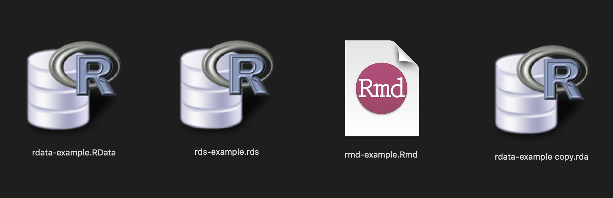
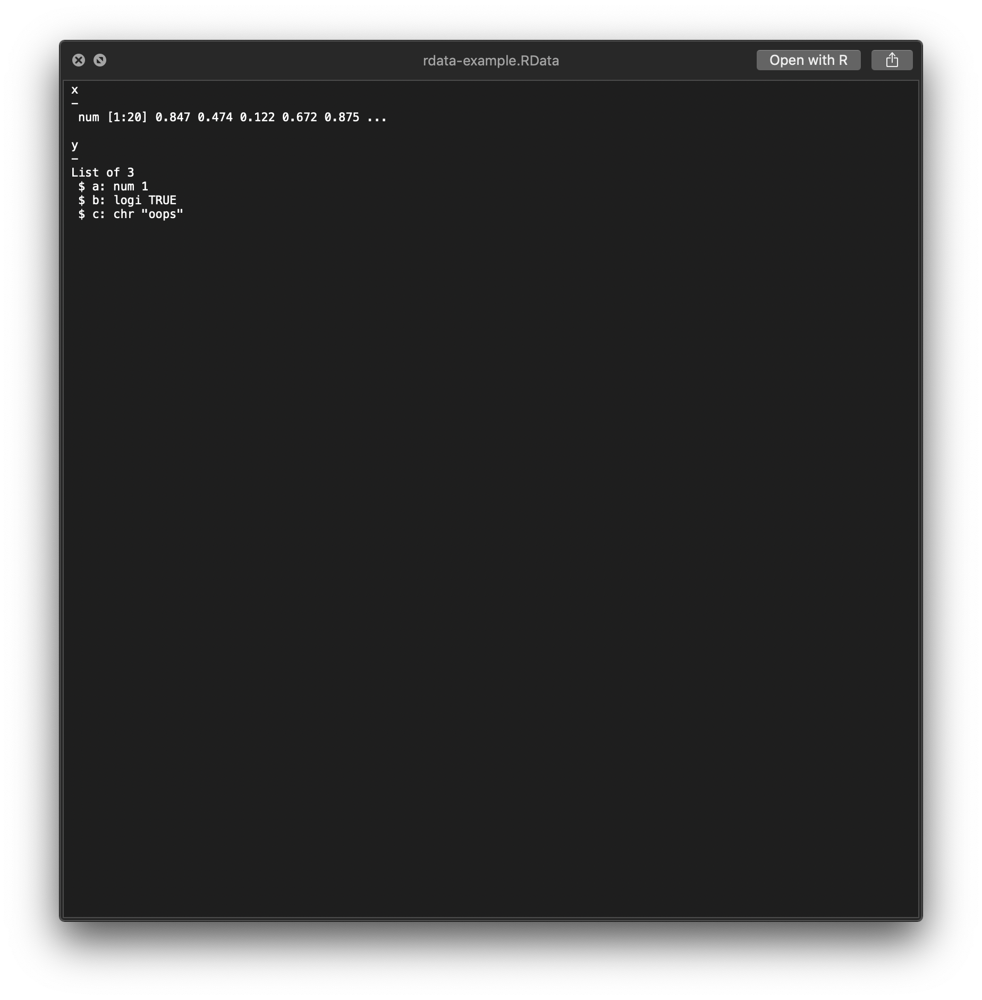
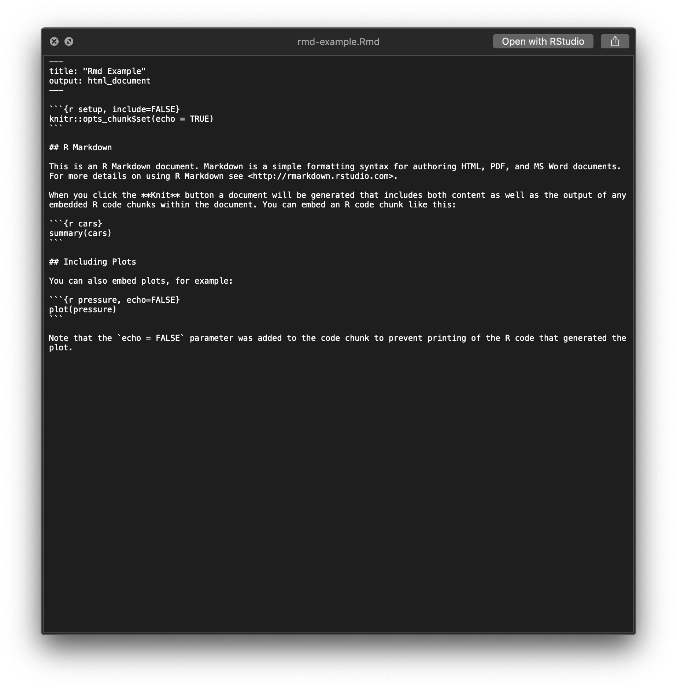

<!-- README.md is generated from README.Rmd. Please edit that file -->

# rdatainfo

Tools and Utilities to Assist in ‘macOS’ ‘QuickLook’ Ops

## Description

Provides support for the ‘QuickLookR’ ‘macOS’ ‘QuickLook’ plugin
(<https://github.com/hrbrmstr/QuickLookR>).

Enables preview of rda/rdata/rds files and preview/editing of R Markdown
(Rmd) files.








### Installation

``` r
devtools::install_github("hrbrmstr/rdatainfo")
```
